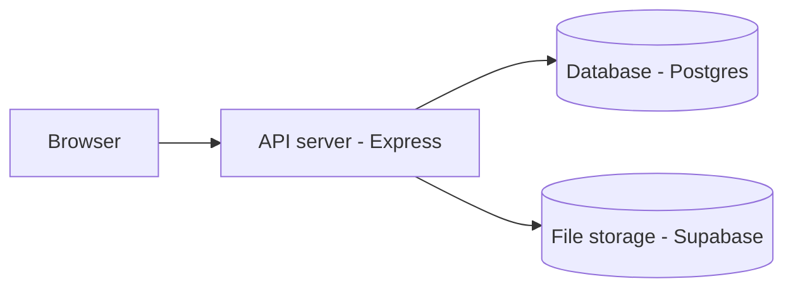

# Threshold

**Your work. Your links. Your presence.** One page that's whatever you need it to be — a portfolio, a link-in-bio, or a lightweight storefront — for freelancers, creators, students, and anyone building a real presence online.

🔗 **Live:** [thrshld.in](https://thrshld.in)

---

## What is this

Most link-in-bio tools (Linktree, Beacons) give everyone the same portrait-shaped stack of buttons, squeezed onto desktop with dead space on either side. Threshold is built differently, on two ideas:

1. **Your work is the centerpiece, not your links.** Featured projects, certifications, achievements, and documents get real visual weight — not squeezed into another link row.
2. **Desktop and mobile are two real, separately-designed layouts**, not one responsive template reflowed between breakpoints — a horizontal desktop experience, and a genuinely simplified vertical mobile view.

Every section — Updates, Featured Work, Links — only shows up if you've actually used it. No empty placeholders, no clutter. That means the same profile structure works equally well as a full portfolio, a simple link hub, or a "here's what I make, here's where to buy it" page — the person using it decides, not a template.

## Architecture



## Features

- **Structured showcase, not just links** — projects, certifications, achievements, and documents, each with an image, description, and type
- **Time-limited Updates feed** — short-lived posts that auto-expire after 15 days, keeping your page current without manual cleanup
- **Auto-hiding sections** — unused sections (Links, Updates, Featured Work) simply don't render on your public page
- **Two real layouts** — dedicated desktop and mobile designs, not a single responsive template
- **Color theme presets** — pick a look for your public profile, no design work required
- **Click + view analytics** — see how your page and links are actually performing, with a day-by-day breakdown
- **Native share sheet integration** — one-tap sharing on mobile via the Web Share API
- **Guided onboarding** — a short setup wizard gets a new profile live in minutes

## Tech stack

**Backend**

- Node.js + Express
- PostgreSQL (Drizzle ORM)
- bcrypt + JWT auth, stored as httpOnly cookies
- Supabase Storage for file uploads (images auto-compressed and converted to WebP via `sharp`)
- Zod for request validation
- Centralized error-handling middleware

**Frontend**

- React + Vite (JavaScript, no TypeScript)
- React Router
- Recharts (analytics visualizations)
- Axios, with a centralized response interceptor for consistent error handling

**Infrastructure**

- Frontend hosted on **Vercel**
- Backend hosted on **Render**
- Database + file storage on **Supabase**
- Custom domain via Porkbun, DNS-routed to production

## Why it's built this way

A few deliberate engineering decisions worth calling out:

- **Two-layer auth middleware.** A global middleware reads and verifies the JWT on every request without ever blocking it, distinguishing an expired token from a missing one. A second, route-level middleware enforces the actual auth requirement, using that distinction to return a more specific "session expired" vs. "unauthorized" message.
- **IDOR prevention by default.** Every ownership check queries `WHERE id = :id AND user_id = req.user.user_id` — the user ID always comes from the verified token, never from the request body.
- **Non-blocking analytics writes.** Click and profile-view events are logged with `.catch()` instead of `await`, so a failed analytics insert can never break a real user-facing request like a redirect or a page load.
- **Real Postgres enums**, not just app-level validation, for fields like showcase item type and analytics event type — with Zod handling request-level validation on top as the first line of defense.
- **Auto-delete with safe partial failure.** Updates older than 15 days are cleaned up (including their stored images) lazily on read. If the cleanup step fails, it's logged and swallowed — the read itself, and the data the user came to see, is never blocked by a failed cleanup.

## Project structure

```
Threshold/
│
├── client/                         # React + Vite frontend
│   ├── public/
│   └── src/
│       ├── assets/                 # Images and static assets
│       ├── components/
│       │   ├── auth/               # Authentication & onboarding
│       │   ├── dashboard/          # Dashboard features
│       │   ├── marketing/          # Landing/marketing pages
│       │   ├── publicProfile/      # Public profile layouts
│       │   └── shared/             # Reusable UI components
│       ├── context/                # Global React state
│       ├── data/                   # Static/configuration data
│       ├── hooks/                  # Custom React hooks
│       ├── service/                # API/service functions
│       ├── utils/                  # Frontend utilities
│       ├── App.jsx
│       ├── App.css
│       ├── index.css
│       └── main.jsx
│
├── server/                         # Node.js + Express backend
│   ├── config/                     # Environment & external service config
│   ├── db/                         # Database configuration
│   ├── middlewares/
│   │   ├── auth.middleware.js      # Authentication
│   │   ├── errorHandler.middleware.js
│   │   ├── fileUpload.middleware.js
│   │   └── validation.middleware.js
│   ├── models/                     # Drizzle database schemas
│   ├── routes/                     # API routes
│   ├── utils/                      # Backend utilities
│   ├── validations/                # Request validation schemas
│   ├── drizzle.config.js
│   ├── docker-compose.yml
│   └── server.js                   # Server entry point
│
├── docs/
│   └── wireframes/                 # Early desktop & mobile wireframes
│
├── .gitignore
├── README.md
└── package configuration files
```

## Design process

Wireframes and early planning sketches are in [`/docs/wireframes`](./docs/wireframes) — desktop and mobile layouts were sketched separately from the start, reflecting the two-layout approach the final product uses.

## Getting started locally

**Prerequisites:** Node.js, pnpm, Docker (for local Postgres), a Supabase project (for file storage)

```bash
# clone the repo
git clone https://github.com/<your-username>/threshold.git
cd threshold

# backend
cd backend
pnpm install
docker compose up -d          # starts local Postgres
cp .env.example .env          # fill in your own values
pnpm drizzle-kit push         # creates tables from schema
pnpm dev

# frontend, in a separate terminal
cd frontend
pnpm install
cp .env.example .env          # fill in VITE_API_BASE_URL
pnpm dev
```

### Environment variables

**Backend**
| Variable | Description |
|---|---|
| `DATABASE_URL` | Postgres connection string |
| `JWT_SECRET` | Secret for signing auth tokens |
| `FRONTEND_URL` | Allowed CORS origin |
| `SUPABASE_URL` / `SUPABASE_KEY` | Supabase project credentials, for file storage |
| `NODE_ENV` | `development` or `production` — controls cookie `secure`/`sameSite` behavior |

**Frontend**
| Variable | Description |
|---|---|
| `VITE_API_BASE_URL` | URL of the running backend |

## Roadmap

- User-configurable Updates expiry (currently fixed at 15 days for everyone)
- Explicit per-section visibility toggles, in addition to the current auto-hide-when-empty behavior
- Additional theme presets and layout-level customization

## About this project

Built as a full-stack learning project — first backend/Node build, first production deployment. Every backend route and piece of business logic was written and debugged by hand; the frontend UI was scaffolded with AI assistance and then wired to the real API by hand, including auth flow, partial-update semantics, and error handling.
